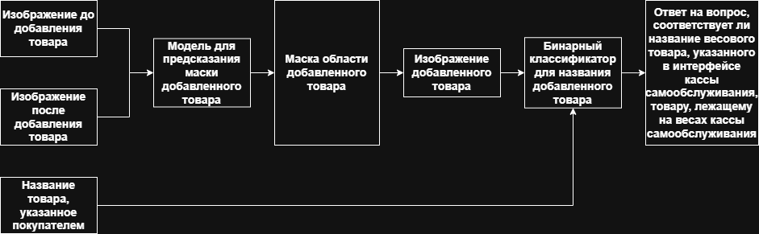

# Проект по выявлению мошенничества покупателей на кассах самообслуживания

## Описание проекта

В контексте проекта касса самообслуживания имеет весовую платформу и камеру, направленную на неё.

На кассах самообслуживания возможны случаи, при которых покупатель кладёт на весовую платформу дорогой товар, а в интерфейсе выбирает более дешёвый весовой товар. Такие операции несут убытки магазинам.

В момент выбора покупателем в интерфейсе кассы самообслуживания названия весового товара получаем следующие данные:
1. Изображение до добавления товара
2. Изображение после добавления товара
3. Название весового товара

Решено две задачи:
1. Сегментация добавленного товара
2. Идентификация добавленного товара (получение ответа на вопрос: соответствует ли товар на весах кассы самообслуживания названию товара, указанного покупателем в интерфейсе?)

В рамках проекта разработано решение, которое в режиме реального времени позволяет отслеживать мошенничесике действия покупателей
на кассах самообслуживания.

## Итоговый пайплайн

