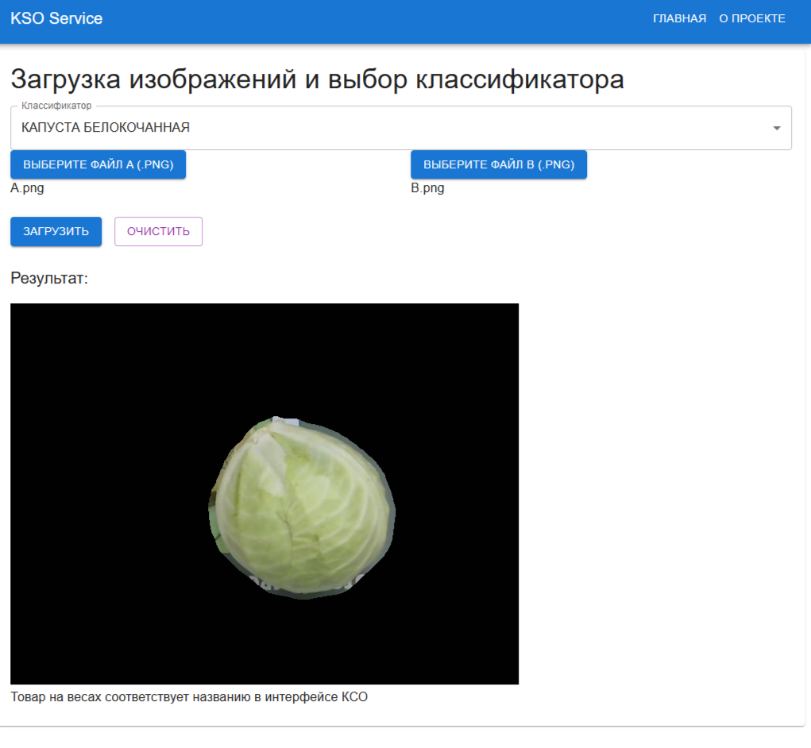

# Проект по выявлению мошенничества покупателей на кассах самообслуживания

## Описание проекта

В контексте проекта касса самообслуживания имеет весовую платформу и камеру, направленную на неё.

На кассах самообслуживания возможны случаи, при которых покупатель кладёт на весовую платформу дорогой товар, а в интерфейсе выбирает более дешёвый весовой товар. В результате таких операций магазины несут убытки.

В момент выбора покупателем в интерфейсе кассы самообслуживания названия весового товара получаем следующие данные:
1. Изображение до добавления товара
2. Изображение после добавления товара
3. Название весового товара

Решено две задачи:
1. Сегментация добавленного товара
2. Идентификация добавленного товара (получение ответа на вопрос: соответствует ли товар на весах кассы самообслуживания названию товара, указанного покупателем в интерфейсе?)

В рамках проекта было получено решение, которое может в режиме реального времени отслеживать мошенничество покупателей на кассах самообслуживания. Среднее время работы всего пайплайна составляет менее 100 мс на CPU.

## Итоговый пайплайн


## Пример работы пайплайна



В данном примере на весах кассы самообслуживания лежит капуста белокочанная, в интерфейсе
покупателем указано название весового товара "КАПУСТА БЕЛОКОЧАННАЯ".
Ответ пайплайна говорит о том, что товар на весах совпадает с названием в интерфейсе, это соответствует действительности

## Запуск проекта

```sh

# build
docker compose up --build

# run
docker compose up
```

В demo.ipynb находится пример обращения к МЛ-микросервису