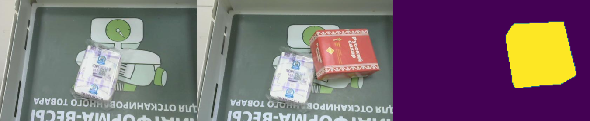

[Ссылка](https://github.com/wgcban/ChangeFormer?tab=readme-ov-file) на оригинальный репозиторий модели Changeformer

## Краткое описание проекта 

Формат данных: изображение до добавления товара, изображение после добавления товара, бинарная маска изменения 

1. Получаем маску изменения между двумя изображениями
2. Классифицируем изменения, чтобы определить, соответствует ли товар, который покупатель положил на кассу самообслуживания, названию товара, указанного им в кассовом ПО


## Скачивание необходимых файлов

1. Скачайте папки checkpoints и classification_models по [ссылке](https://drive.google.com/drive/folders/1H61bM1Q2QagrBMJiPrk0qrGBIBUZs3MZ?usp=sharing) из гугл диска

2. Положите папки checkpoints и classification_models в папку src

## Запуск проекта

```sh
docker build -t kso:v1 .

# запуск контейнера с поддержкой только cpu
docker run -p 8000:8000 kso:v1

# запуск контейнера с поддержкой cuda
docker run -p 8000:8000 --gpus=all kso:v1
```

После предыдущего шага вы можете протестировать проект на тестовых изображениях из папки test_images по [ссылке](http://0.0.0.0:8000/) (Linux) / [ссылке](http://127.0.0.1:8000/) (Windows)

документация API после запуска контейнера будет доступна по [ссылке](http://0.0.0.0:8000/docs) (Linux) / [ссылке](http://127.0.0.1:8000/docs) (Windows)

Пример обращения к сервису находится в demo.ipynb