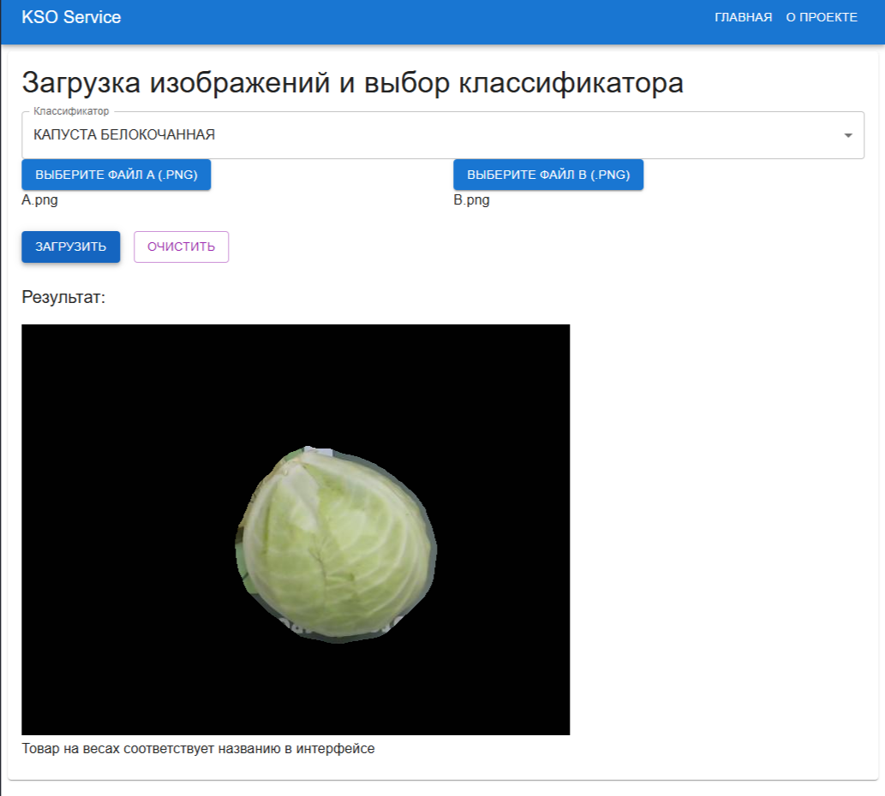

## Стек Frontend-части проекта: React.js

## Пример работы пайплайна

В данном примере на весах кассы самообслуживания лежит капуста белокочанная, в интерфейсе
покупателем указано название весового товара "КАПУСТА БЕЛОКОЧАННАЯ".
Ответ пайплайна говорит о том, что товар на весах соответствует названию в интерфейсе, это соответствует действительности